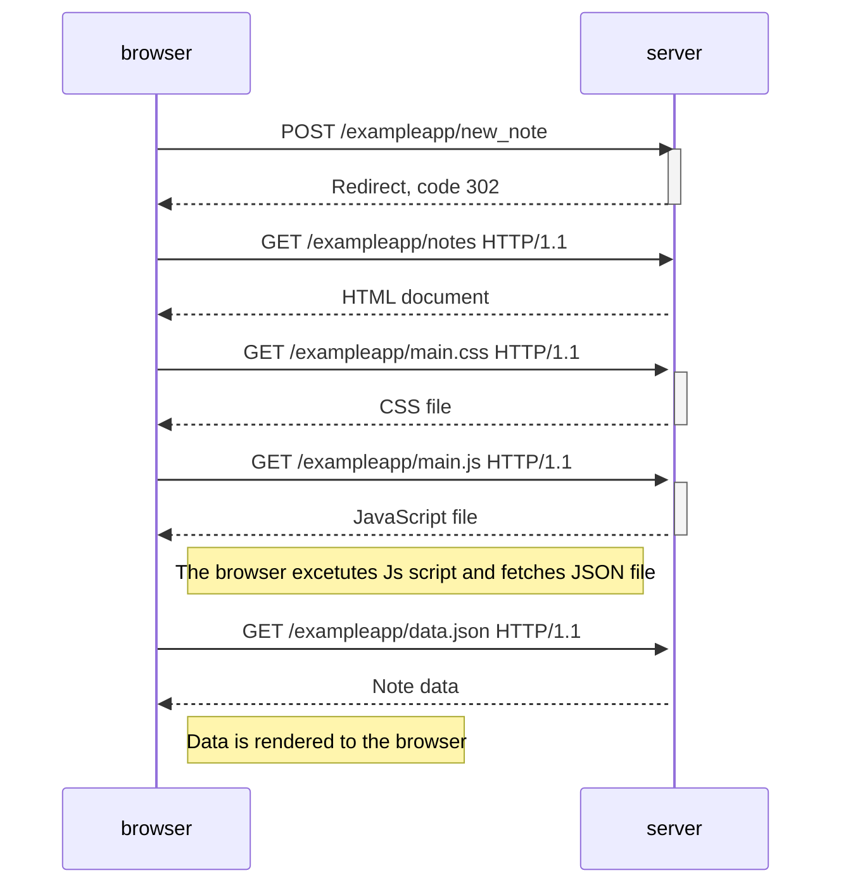

```mermaid
sequenceDiagram
    participant browser
    participant server

    browser->>server: POST /exampleapp/new_note
    activate server
    server-->>browser: Redirect, code 302
    deactivate server
    browser->>server: GET /exampleapp/notes HTTP/1.1
    activate server
    server-->>browser: HTML document

    browser->>server: GET /exampleapp/main.css HTTP/1.1
    activate server
    server-->>browser: CSS file
    deactivate server

    browser->>server: GET /exampleapp/main.js HTTP/1.1
    activate server
    server-->>browser: JavaScript file
    deactivate server

    Note right of browser: The browser excetutes Js script and fetches JSON file

    browser->>server: GET /exampleapp/data.json HTTP/1.1
    activate server
    server-->>browser: Note data

    Note right of browser: Data is rendered to the browser
```
    
